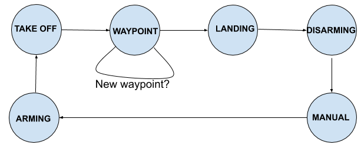
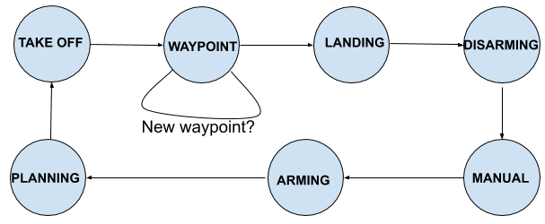
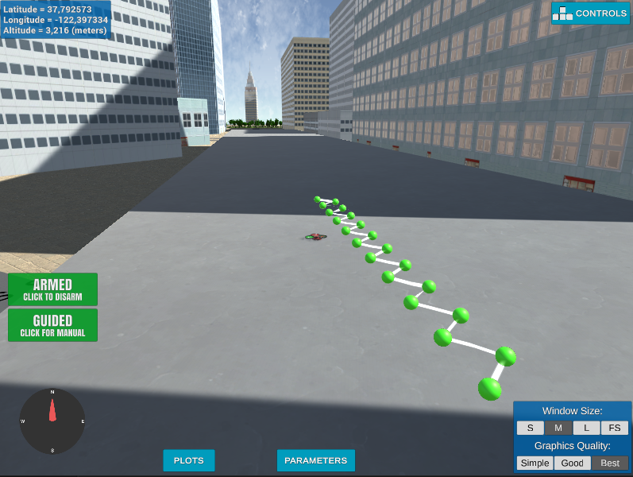
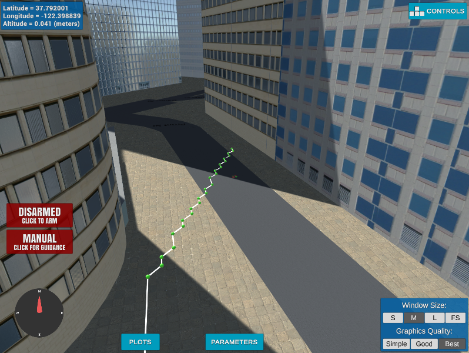
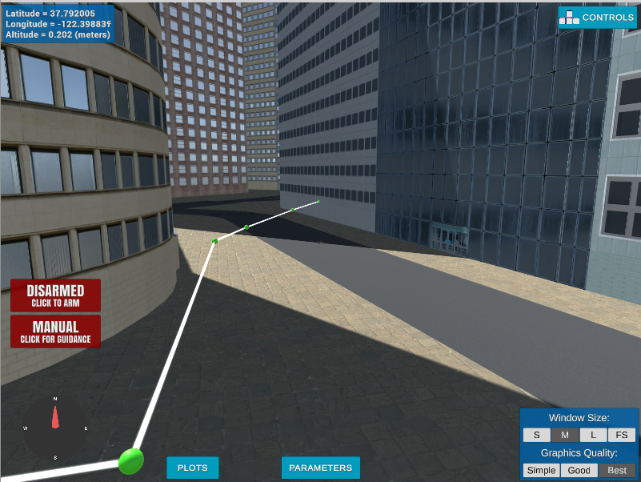
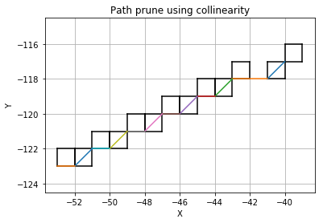
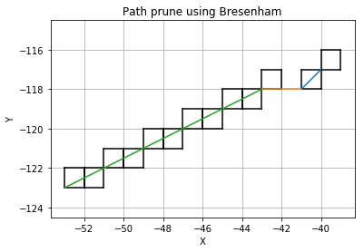

## Project: 3D Motion Planning


---


# Required Steps for a Passing Submission:
1. Load the 2.5D map in the colliders.csv file describing the environment.
2. Discretize the environment into a grid or graph representation.
3. Define the start and goal locations.
4. Perform a search using A* or other search algorithm.
5. Use a collinearity test or ray tracing method (like Bresenham) to remove unnecessary waypoints.
6. Return waypoints in local ECEF coordinates (format for `self.all_waypoints` is [N, E, altitude, heading], where the drone’s start location corresponds to [0, 0, 0, 0].
7. Write it up.
8. Congratulations!  Your Done!

## [Rubric](https://review.udacity.com/#!/rubrics/1534/view) Points
### Here I will consider the rubric points individually and describe how I addressed each point in my implementation.  

---
### Writeup / README

#### 1. Provide a Writeup / README that includes all the rubric points and how you addressed each one.  You can submit your writeup as markdown or pdf.  

You're reading it! Below I describe how I addressed each rubric point and where in my code each point is handled.

### Explain the Starter Code

#### 1. Explain the functionality of what's provided in `motion_planning.py` and `planning_utils.py`
In the following figures it is possible to see the differences between the states of the `backyard_flyer_solution.py` and `motion_planning.py` scripts.
 



The main difference is that the `motion_planning.py` script has an additional state `PLANNING`, where the waypoints of the route are calculated between a `start` and
`goal` points using the **A\* Algorithm**. This route calculation is done in the `path_plan()` function. 
In the `backyard_flyer_solution.py` scrip there is no path planning. The waypoints of the path are generated during the `TAKEOFF` state
and are four fixed points that form a square path.

The operation of the `path_plan`function is detailed below. Some additional functions included in `planning_utils.py` are used too.
* The file `colliders.csv` is read. This file has the positions and dimensions of all the obstacles of the environment.
* Using the `create_grid` function, a 2D grid representation of the environment is created. This function receives as input parameters 
the position of the obstacles, the altitude of the drone and a safety distance around the obstacles. It returns a 2D matrix which
indicates if the cell is feasible to fly or if it is occupied by an obstacle.
* Next step is to call the `a_star`, which finds the shortest 2D path between two points using the **A\* Algorithm**.
* Finally all the points of the path obtained in the previous step are included in the list of waypoints which will be used during `WAYPOINT` state.
 
Another difference between `motion_planning.py` and `backyard_flyer_solution.py` is that the first one uses the `send_waypoints` function to show the path in the simulator.
In the following image shows how the path is represented in the simulator[^1].


As can be seen in the image above, the drone moves following a strange zigzag path instead a straight line. This is due the search algorithm doesn't support diagonal movements.


### Implementing Your Path Planning Algorithm

#### 1. Set your global home position
The first line of `colliders.csv` contains the geodetic coordinates that correspond to point `(0,0)` of the environment obstacle map. The code bellow get these coordinates and set them as global home position of the drone.

```python
with open("colliders.csv", "r") as file:
	line = file.readline().rstrip()
data = re.split('[,| ] *', line)
lat0 = float(data[1])
lon0 = float(data[3])

self.set_home_position(lon0, lat0, 0);
```
The altitude is setted to 0 because we are working 2.5D mode.

#### 2. Set your current local position
To set the current local position of the drone, the first step is to retrieve from the drone the global position. This can be achieved using either the `global_home` variable or `_latitude, _longitude, _latitude` variables. This position is in geodetic coordinates therefore it is necessary to convert them to local coordinates in order to work with the environment map.

```python
global_position = np.array([self._longitude, self._latitude, self._altitude]) 
local_north, local_east, local_alt = global_to_local(global_position, self.global_home) 
```

#### 3. Set grid start position from local position
With the code below, the drone can search the path to the goal from any position on the map instead of just the center of the map as it has been until now.
To set the start point on the grid map, the offset of the grid must be subtracted from the current local position coordinates.

```python
grid_start = (int(np.ceil(local_north - north_offset)), int(np.ceil(local_east - east_offset)))
```

#### 4. Set grid goal position from geodetic coords
The goal position in geoditc coordinates is received as an input parameter named `target_global_position` when `MotionPlanning` class is created. The format of the coordinate is `(longitude, latitude, altitude)`, the latitud is ginored because the program always works at the same working altitude. Here is an example:
```python
drone = MotionPlanning(conn, target_global_position=np.array([-122.398855, 37.792007, 5]))
```
Once the global coordinates are received, the `TARGET_ALTITUD` is setted as the working altitud, and the coordinates are transformed to local coordinates. Finally to the local coordinates are subtracted the offset of the grid map.
```python
target_global_position = self.target_global_position
target_global_position[2] = TARGET_ALTITUDE
local_goal = global_to_local(target_global_position, self.global_home)
grid_goal = (int(np.ceil(local_goal[0] - north_offset)), int(np.ceil(local_goal[1] - east_offset)))
```
This step is to add flexibility to the desired goal location. Should be able to choose any (lat, lon) within the map and have it rendered to a goal location on the grid.

#### 5. Modify A* to include diagonal motion (or replace A* altogether)
The A\* algorithm has been modified to add diagonal movements. For it the following modifications have been done in the  'planning_utils.py` file.

In the `Action` class it has been added 4 new action types with a cost of sqrt(2).

```python
NW = (-1, -1, np.sqrt(2))
NE = (-1, 1, np.sqrt(2))
SW = (1, -1, np.sqrt(2))
SE = (1, 1, np.sqrt(2))
```
In `valid_actions` function, it has been added four new checks for the new actions.
```python
if x - 1 < 0 or y - 1 < 0 or grid[x - 1, y - 1] == 1:
	valid_actions.remove(Action.NW)
if x - 1 < 0 or y + 1 > m or grid[x - 1, y + 1] == 1:
	valid_actions.remove(Action.NE)
if x + 1 > n or y - 1 < 0 or grid[x + 1, y - 1] == 1:
	valid_actions.remove(Action.SW)
if x + 1 > n or y + 1 > m or grid[x + 1, y + 1] == 1:
	valid_actions.remove(Action.SE)
```

#### 6. Cull waypoints 
To prune the path of unnecessary waypoints, it has been tested two methods, the first one checking the collinearity of the waypoints and the second one using the Bresenham algorithm. In the images below are shown the results after applying these two methods to our algorithm.

Using collinearity | Using Bresenham algorithm
--- | --- 
|  
|  

The Bresenham algorithm remove more unnecesary waypoints and a smooter path is obtained. The code of the developed funcion can be seen below.

```python
def prune_path_bresenham(path):
    pruned_path = [p for p in path]

    i = 0
    while i < len(pruned_path) - 2:
        p1 = pruned_path[i]
        p2 = pruned_path[i+1]
        p3 = pruned_path[i+2]

        cells = list(bresenham(p1[0], p1[1], p3[0], p3[1]))

        i += 1
        for q in cells:
            if(q[0] == p2[0] and q[1] == p2[1]):
                pruned_path.remove(p2)
                i -= 1
                break;

    return pruned_path
```


### Execute the flight
#### 1. Does it work?
Once the simulator is running for the first time, it is necessary to manually dodge an initial obstacle[^1]. After that here is an example of how to run the script.
```shell
python motion_planning.py --latitude=37.792007 --longitude=122.398855
```
The script work properly and the drone reach his target.

One thing to improve is the computational cost of the path planning. When the goal point is far away, the drone takes a long time to calculate the path before take off. It can be improved modifying A\* algorithm using using graphs or random point instead of grids. 


### Double check that you've met specifications for each of the [rubric](https://review.udacity.com/#!/rubrics/1534/view) points.
  
# Extra Challenges: Real World Planning

For an extra challenge, consider implementing some of the techniques described in the "Real World Planning" lesson. You could try implementing a vehicle model to take dynamic constraints into account, or implement a replanning method to invoke if you get off course or encounter unexpected obstacles.

[^1]: In the simulator exists one building at the center of the map. The height of the building is 3 meters. 
In order to run the original scripts without problems, it is necessary to move the drone in MANUAL mode and leave it on the roof of the building. After that it is already possible to run the scripts.
